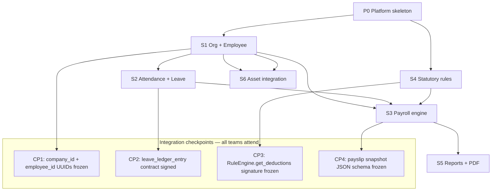

# Indian HRMS Backend — Parallel Frappe Conversion Playbook

> **Audience:** Engineering team converting [Frappe HR](reference/hrms/) + [ERPNext Employee](reference/erpnext/) into our **FastAPI + PostgreSQL** stack.  
> **Stack:** FastAPI · PostgreSQL · Alembic · existing patterns in `backend/app/`  
> **Scope:** Core 80% — Employee, Attendance, Leave, Payroll + Indian statutory compliance  
> **Reference clones:** `reference/hrms/`, `reference/erpnext/` (read-only — study & reimplement, never copy GPL code verbatim into our repo)

---

## How to use this document

| Role | Read first |
|------|------------|
| **Tech lead** | §0 Design rule · §1 Parallel lanes · §2 Dependency graph · §9 Open decisions |
| **Stream owner** | Your lane in §3 + matching rows in §4 Frappe map |
| **Backend dev** | §5 Conversion recipe · §6 Target folder layout · §7 Shared contracts |
| **QA / Finance** | §8 Golden tests · statutory sign-off checklist in each stream |

Each stream can run **in parallel** once §7 contracts are agreed in Week 1. Streams only block on **integration checkpoints**, not on full upstream completion.

---

## 0. Non-negotiable design rule

Frappe HR works in India because statutory rules (PF, ESI, PT, TDS, gratuity) are **data**, not code. With the four Labour Codes effective from **21 Nov 2025** (50% wage rule, gratuity eligibility changes, etc.), this is mandatory.

> **Every statutory number** (PF %, ESI ceiling, PT slab, TDS slab, gratuity formula inputs) is stored with `effective_from` / `effective_to`, **never hardcoded** in Python.

Our tables must support compliance-team updates **without a deploy**. Each payslip stores which rule version was applied.

---

## 1. Parallel workstreams (assign owners)

| Lane | Phase | Owner (fill in) | Can start | Hard dependency |
|------|-------|-----------------|-----------|-----------------|
| **P0 — Platform** | Auth, tenancy, RBAC, migrations, rule-engine interface | | Day 1 | None |
| **S1 — Org & Employee** | Company, branch, dept, designation, employee master | | After P0 conventions (Day 3) | P0 |
| **S2 — Attendance & Leave** | Shift, check-in, holiday, leave ledger, applications | | Day 5 (models); Day 10 (employee FK) | S1 employee `id` |
| **S3 — Payroll engine** | Salary structure, assignment, payroll run, payslip | | Day 8 (components); Day 15 (assignments) | S1; S2 for LWP |
| **S4 — Statutory rules** | PF, ESI, PT, TDS, gratuity, bonus, LWF rule tables + calculators | | Day 5 (rule schema); Day 20 (wire to payroll) | §7 RuleEngine contract |
| **S5 — Compliance outputs** | Payslip PDF, PF ECR, ESI return, statutory breakup API | | Day 25 | S3 payslip schema |
| **S6 — Asset integration** | Replace Frappe sync with native HR events | | Day 15 (employee events) | S1 employee status webhooks |

**Out of scope (Phase 2+):** Recruitment, Performance, Expense Claims, Loans, Asset-linked HR — bolt onto Employee Master later.

---

## 2. Dependency graph & integration checkpoints



| Checkpoint | Week | Deliverable | Sign-off |
|------------|------|-------------|----------|
| **CP0** | 1 | Alembic naming, `company_id` on all tenant tables, RBAC role enum | Tech lead |
| **CP1** | 2 | `employees` table + CRUD + `GET /employees/{id}/history` | S1 + S6 |
| **CP2** | 4 | Leave ledger append-only API; balance = sum(ledger) | S2 + S3 |
| **CP3** | 3 | `StatutoryRuleEngine` interface + fixture JSON | S4 + S3 |
| **CP4** | 7 | Payslip row + `rule_versions` JSON column | S3 + S5 |
| **CP5** | 10 | Golden payslip set passes (finance sign-off) | S3 + S4 + Finance |

---

## 3. Stream deliverables (sprint-sized)

### P0 — Platform skeleton (Sprint 0, ~1 week)

**Goal:** Shared foundation so four teams do not collide.

| Task | Our target | Frappe reference (study only) |
|------|------------|-------------------------------|
| `company_id` row-level tenancy | All HR tables include `company_id` FK | `erpnext/setup/doctype/company/` |
| HR RBAC roles | `HR_ADMIN`, `PAYROLL_ADMIN`, `MANAGER`, `EMPLOYEE` + permission matrix | Frappe Role / Has Role patterns |
| Migration `017_hrms_foundation` | Empty schema + enums | — |
| `StatutoryRuleEngine` ABC | `get_rules(as_of_date, state, company_id)` → rule DTOs | `hrms/regional/india/` |
| Event bus stub | `employee.left`, `payroll.submitted` internal events | Frappe webhooks concept |

**Definition of done:** Two dummy services in different folders can import shared contracts without circular imports.

---

### S1 — Organization & Employee Master (Sprints 1–2)

**Goal:** Replace ERPNext Employee + org hierarchy as system of record.

#### Entities → tables

| Our table | Frappe / ERPNext DocType | Primary source file |
|-----------|--------------------------|---------------------|
| `company` | Company | `erpnext/erpnext/setup/doctype/company/company.py` |
| `branch` | Branch | `erpnext/erpnext/setup/doctype/branch/` |
| `department` | Department | `erpnext/erpnext/setup/doctype/department/department.py` |
| `designation` | Designation | `erpnext/erpnext/setup/doctype/designation/` |
| `grade` | Employee Grade | `hrms/hr/doctype/employee_grade/` |
| `employee` | Employee | `erpnext/erpnext/setup/doctype/employee/employee.py` |
| `employee_document` | (custom) | India fields in `hrms/regional/india/setup.py` |
| `employee_bank_detail` | Employee bank fields | `employee.py` + India `ifsc_code`, `micr_code` |
| `employee_statutory_id` | India custom fields | `pan_number`, `provident_fund_account`, `uan` in `setup.py` |
| `employee_property_history` | Employee Property History | `hrms/hr/doctype/employee_property_history/` |
| `employee_transfer` | Employee Transfer | `hrms/hr/doctype/employee_transfer/` |
| `employee_promotion` | Employee Promotion | `hrms/hr/doctype/employee_promotion/` |

#### Company statutory flags (on `company`)

| Field | Frappe equivalent |
|-------|-------------------|
| `pf_applicable` | Company PF settings |
| `esi_applicable` | Company ESI settings |
| `lwf_state` | State-wise LWF |
| `pt_state` | Professional tax state |

#### APIs (implement)

```
GET/POST/PATCH  /companies, /branches, /departments, /designations, /grades
GET/POST/PATCH  /employees
GET             /employees?status=active&department=
GET             /employees/{id}/history
```

#### Conversion notes

- **Versioned designation/dept:** Mirror `employee_property_history` — never overwrite; append with `effective_from`.
- **Aadhaar:** Store hashed / last-4 only (UIDAI). Frappe often stores PAN in plain — we encrypt at rest.
- **Do not port** Frappe's `naming_series` — use our UUID/int PK + `employee_number` business key.
- **Study** `employee.py` validation: joining date, relieving date, status transitions (`Active` → `Left`).

#### S1 parallel tasks (can split across 2 devs)

| Dev A | Dev B |
|-------|-------|
| Company + branch + dept CRUD | Designation + grade + employment type |
| Employee CRUD + documents | Transfer/promotion history + `/history` API |
| India statutory ID fields | Bank details + company applicability flags |

**Definition of done:** CP1 passed; asset app can stop calling Frappe for employee name/dept/status.

---

### S2 — Attendance & Leave (Sprints 3–4)

**Goal:** Ledger-based leave (Frappe's best pattern) + attendance feeding payroll LWP.

#### Entities → tables

| Our table | Frappe DocType | Primary source file |
|-----------|----------------|---------------------|
| `shift_type` | Shift Type | `hrms/hr/doctype/shift_type/shift_type.py` |
| `shift_assignment` | Shift Assignment | `hrms/hr/doctype/shift_assignment/` |
| `employee_checkin` | Employee Checkin | `hrms/hr/doctype/employee_checkin/employee_checkin.py` |
| `attendance_record` | Attendance | `hrms/hr/doctype/attendance/attendance.py` |
| `attendance_request` | Attendance Request | `hrms/hr/doctype/attendance_request/` |
| `holiday_list` | Holiday List | `hrms/utils/holiday_list.py` |
| `holiday_list_assignment` | Holiday List Assignment | `hrms/hr/doctype/holiday_list_assignment/` |
| `leave_type` | Leave Type | `hrms/hr/doctype/leave_type/leave_type.py` |
| `leave_period` | Leave Period | `hrms/hr/doctype/leave_period/` |
| `leave_policy` | Leave Policy | `hrms/hr/doctype/leave_policy/` |
| `leave_allocation` | Leave Allocation | `hrms/hr/doctype/leave_allocation/leave_allocation.py` |
| `leave_application` | Leave Application | `hrms/hr/doctype/leave_application/leave_application.py` |
| `leave_balance_ledger` | **Leave Ledger Entry** | `hrms/hr/doctype/leave_ledger_entry/leave_ledger_entry.py` |
| `leave_encashment` | Leave Encashment | `hrms/hr/doctype/leave_encashment/` |

#### APIs

```
POST  /attendance/check-in
POST  /attendance/check-out
GET   /employees/{id}/attendance?from=&to=
POST  /leave-applications
PATCH /leave-applications/{id}/approve
PATCH /leave-applications/{id}/reject
GET   /employees/{id}/leave-balance
```

#### Critical conversion rule: leave balance

Frappe's `Leave Ledger Entry` is append-only (`transaction_type`: Allocation, Application, Encashment, Expiry). **Copy this exactly** — no mutable `balance` column.

Study tests: `leave_ledger_entry/test_leave_ledger_entry.py`, `leave_application/test_leave_application.py`.

#### S2 parallel tasks

| Dev A (Attendance) | Dev B (Leave) |
|--------------------|---------------|
| Shift type + assignment | Leave type + policy + period |
| Check-in/out + source enum | Leave allocation → ledger rows |
| Attendance mark + holiday calendar | Leave application + approval workflow |
| Attendance request / regularization | Encashment + compensatory leave |

**Statutory flag:** Maternity leave = 26 weeks (`leave_type` config). Leave encashment affects wage base for 50% rule — expose `is_part_of_wage` on leave encashment earnings (payroll team input).

**Definition of done:** CP2 passed; `salary_slip` can query LWP days for a period (mock payroll consumer).

---

### S3 — Salary Structure & Payroll Engine (Sprints 5–7)

**Goal:** Reimplement Frappe payroll pipeline without ERPNext GL posting (out of scope).

#### Entities → tables

| Our table | Frappe DocType | Primary source file |
|-----------|----------------|---------------------|
| `salary_component` | Salary Component | `hrms/payroll/doctype/salary_component/salary_component.py` |
| `salary_structure` | Salary Structure | `hrms/payroll/doctype/salary_structure/salary_structure.py` |
| `salary_structure_component` | Salary Detail (child) | `hrms/payroll/doctype/salary_detail/` |
| `employee_salary_structure_assignment` | Salary Structure Assignment | `hrms/payroll/doctype/salary_structure_assignment/` |
| `payroll_period` | Payroll Period | `hrms/payroll/doctype/payroll_period/` |
| `payroll_run` | Payroll Entry | `hrms/payroll/doctype/payroll_entry/payroll_entry.py` |
| `payslip` | Salary Slip | `hrms/payroll/doctype/salary_slip/salary_slip.py` |
| `payslip_component_detail` | Salary Detail on slip | child table in `salary_slip.py` |
| `additional_salary` | Additional Salary | `hrms/payroll/doctype/additional_salary/` |

#### Calculation flow (port logic, not code)

Study `salary_slip.py` method order:

1. `get_emp_and_working_day_details` → attendance/leave integration
2. `calculate_component_amounts` → earnings then deductions
3. `get_amount_from_formula` → formula evaluator (safe subset — no `eval()`)
4. `calculate_net_pay` → gross − deductions
5. **50% wage rule check** on structure assignment (our addition — not fully in Frappe yet)

#### 50% wage rule (Labour Codes)

On `POST /employees/{id}/assign-salary-structure`:

- Validate `basic + da + retaining_allowance >= 0.5 * ctc`
- Policy: reject **or** auto-adjust (team decision in §9)
- Log `wage_rule_version_id` applied

#### APIs

```
POST  /salary-components
POST  /salary-structures
POST  /employees/{id}/assign-salary-structure
POST  /payroll-runs
GET   /payroll-runs/{id}/payslips
GET   /payslips/{id}
GET   /payslips/{id}/pdf          → S5 implements template
```

#### S3 phased delivery (parallel with S4)

| Sprint | Scope | Statutory |
|--------|-------|-----------|
| 5 | Components + structures + assignment | None |
| 6 | Payroll run + payslip (flat formulas only) | Stub `RuleEngine` returning zeros |
| 7 | Wire real `RuleEngine` + rule version snapshot on payslip | S4 integration |

**Golden tests:** Port scenarios from `salary_slip/test_salary_slip.py` (3000+ lines) — finance must add India-specific cases.

**Definition of done:** CP4 passed; net pay matches Frappe for 5 fixture employees with statutory stub then real rules.

---

### S4 — Statutory Compliance Layer (Sprints 5–10, parallel with S3)

**Goal:** Versioned rule tables + calculators consumed by payroll. **No magic numbers in code.**

#### Rule tables (our schema)

| Our table | Frappe equivalent | India seed data |
|-----------|-------------------|-----------------|
| `pf_rule` | PF config scattered in component + company | Extract from `regional/india/data/salary_components.json` |
| `esi_rule` | ESI components + settings | Same + ESIC circulars |
| `professional_tax_slab` | Professional Tax component logic | State slabs (manual seed) |
| `tds_slab` | Income Tax Slab | `hrms/payroll/doctype/income_tax_slab/` |
| `tds_slab_charge` | Income Tax Slab Other Charges | child table |
| `tax_exemption_category` | Employee Tax Exemption Category | `employee_tax_exemption_category/` |
| `gratuity_rule` | Gratuity Rule + slabs | `gratuity_rule/`, `gratuity_rule_slab/` |
| `bonus_rule` | (partial — Payment of Bonus Act) | New table |
| `lwf_rule` | (state-wise, minimal in Frappe) | New table |

#### Frappe files to study per rule

| Rule | Key logic file |
|------|----------------|
| PF | `salary_component` type `Provident Fund`; reports `provident_fund_deductions/` |
| ESI | Component type + `salary_slip` deduction loop |
| PT | `professional_tax_deductions/` report |
| TDS | `salary_slip.py` → `get_income_tax_slabs`, `calculate_variable_tax`; `income_tax_slab.py` |
| Gratuity | `gratuity_rule.py`, `gratuity.py`; India setup `create_gratuity_rule_for_india()` |
| HRA exemption | `regional/india/utils.py` → `calculate_annual_eligible_hra_exemption` |

#### Rule engine contract (implement first — Week 1)

```python
# backend/app/hrms/statutory/engine.py — S4 owns implementation, S3 owns consumer

class StatutoryRuleEngine:
    def get_pf(self, as_of: date, company_id: int) -> PfRuleDTO: ...
    def get_esi(self, as_of: date, company_id: int) -> EsiRuleDTO: ...
    def get_pt(self, as_of: date, state: str, gross: Decimal) -> Decimal: ...
    def get_tds_monthly(self, ctx: TdsContext) -> TdsResult: ...
    def get_gratuity(self, as_of: date) -> GratuityRuleDTO: ...

    def compute_payslip_deductions(self, ctx: PayslipStatutoryContext) -> StatutoryBreakup:
        """Returns amounts + rule_version_ids for snapshot."""
```

#### S4 parallel tasks

| Dev A | Dev B | Dev C |
|-------|-------|-------|
| PF + ESI rules + admin CRUD | PT slabs (launch states) + LWF | TDS slabs + exemption declarations |
| PF/ESI calculators + unit tests | PT calculator | Gratuity + bonus rules |
| Seed migrations from Frappe India JSON | Finance circular review | `GET /employees/{id}/statutory-breakup` |

**Admin APIs:** CRUD on each `*_rule` table with overlap validation on `(rule_type, state, effective_from)`.

**Definition of done:** CP3 + CP5; deductions match finance golden set; payslip stores `rule_versions` JSON.

---

### S5 — Compliance outputs (Sprint 11)

| Deliverable | Frappe reference |
|-------------|------------------|
| Payslip PDF | `salary_slip` print format + `employee_ctc_break_up` report HTML |
| PF ECR export | `provident_fund_deductions` report |
| ESI return | (build from slip components; Frappe has deductions report) |
| Salary register | `payroll/report/salary_register/` |
| Bank remittance | `payroll/report/bank_remittance/` |

**Definition of done:** PDF layout approved by HR; ECR CSV validates against EPFO upload tool sample.

---

### S6 — Asset platform integration (ongoing from Sprint 2)

**Current state:** `backend/app/integrations/frappe_hr/` syncs employee + exit → asset return.

| Milestone | Action |
|-----------|--------|
| CP1 | Add internal event `employee.status_changed` emitted by S1 |
| Sprint 6 | Dual-write: native HR + Frappe (feature flag) |
| Sprint 10 | Remove Frappe dependency; repoint `hr_sync_service` to native `/employees` |
| Sprint 12 | Delete `integrations/frappe_hr/` (or keep as optional adapter) |

**Mapper reference:** `backend/app/integrations/frappe_hr/mapper.py` — field mapping checklist for S1.

---

## 4. Master Frappe → FastAPI mapping

### In scope — must convert

| Module | Frappe DocTypes (count) | Our module path |
|--------|-------------------------|-----------------|
| ERPNext setup | Company, Branch, Department, Designation, Employee | `backend/app/hrms/org/` |
| HR master | Employee Grade, Transfer, Promotion, Property History | `backend/app/hrms/employee/` |
| Attendance | Shift Type/Assignment, Checkin, Attendance, Attendance Request | `backend/app/hrms/attendance/` |
| Leave | Leave Type, Policy, Period, Allocation, Application, **Ledger Entry**, Encashment | `backend/app/hrms/leave/` |
| Payroll | Component, Structure, Assignment, Period, Entry, Slip, Additional Salary | `backend/app/hrms/payroll/` |
| Tax | Income Tax Slab, Exemption Category/Declaration/Proof | `backend/app/hrms/tax/` |
| Gratuity | Gratuity Rule, Gratuity | `backend/app/hrms/gratuity/` |
| India | Regional custom fields + `salary_components.json` seeds | `backend/app/hrms/statutory/india/` |

### Explicitly out of scope (do not convert now)

| Frappe module | DocTypes | Reason |
|---------------|----------|--------|
| Recruitment | Job Applicant, Job Offer, Interview | Phase 2 |
| Performance | Appraisal, KRA, Goal | Phase 2 |
| Expense | Expense Claim | Phase 2 |
| Loans | Salary Slip Loan, Employee Advance | Phase 2 |
| Benefits | Employee Benefit Application/Claim/Ledger | Phase 2 (complex) |
| Overtime | Overtime Slip/Type | Phase 2 |
| Training, Travel, Grievance | various | Phase 2 |
| ERPNext GL | Journal Entry from payroll | Use export CSV; no accounting |

---

## 5. Conversion recipe (per DocType)

Every developer follows the same steps:

```
1. READ   reference/.../doctype/{name}/{name}.json  → field list, validations, enums
2. READ   {name}.py                                   → business logic, hooks, edge cases
3. READ   test_{name}.py                              → acceptance scenarios to port
4. MODEL  backend/app/hrms/.../models/{name}.py       → SQLAlchemy + effective dates
5. SCHEMA backend/app/hrms/.../schemas/{name}.py      → Pydantic request/response
6. REPO   backend/app/hrms/.../repositories/          → queries, ledger inserts
7. SVC    backend/app/hrms/.../services/                → port logic in clean Python
8. API    backend/app/api/v1/hrms/                      → FastAPI routes + permissions
9. TEST   backend/tests/hrms/test_{name}.py             → port Frappe test cases
10. DOC   Add row to §4 mapping if new DocType
```

### Port vs rewrite

| Copy pattern from Frappe | Rewrite from scratch |
|--------------------------|----------------------|
| Field names & validation rules | `frappe.db` / `get_doc` / `save` |
| Formula dependency order in salary slip | `frappe.utils`, whitelisted `eval` |
| Leave ledger transaction types | Permission system (`frappe.has_permission`) |
| India component types (PF, PT, ESI) | DocType meta framework |
| Test case scenarios (inputs → expected) | Jinja print formats → WeasyPrint/HTML |

---

## 6. Target folder layout

```
backend/app/
  hrms/
    org/           # S1: company, branch, department
    employee/      # S1: employee, documents, bank, statutory ids
    attendance/    # S2
    leave/         # S2
    payroll/       # S3: structure, run, payslip
    statutory/     # S4: rules + engine
    tax/           # S4: declarations, slabs
    events/        # employee.left, payroll.submitted
  api/v1/hrms/
    employees.py
    attendance.py
    leave.py
    payroll.py
    statutory.py
alembic/versions/
  017_hrms_foundation.py
  018_hrms_org_employee.py
  019_hrms_attendance_leave.py
  020_hrms_payroll.py
  021_hrms_statutory_rules.py
tests/hrms/
  fixtures/        # golden payslips from finance
  test_pf.py
  test_salary_slip.py
```

Register routes in `backend/app/main.py` under prefix `/api/v1/hrms`.

---

## 7. Shared contracts (freeze in Week 1 meeting)

### 7.1 IDs and tenancy

- All HR tables: `id` (int PK), `company_id` (FK), `created_at`, `updated_at`
- Employee business key: `employee_number` (unique per company)
- External sync key: `external_id` (nullable; for migration from Frappe `name`)

### 7.2 Leave ledger row

```json
{
  "employee_id": 1,
  "leave_type_id": 3,
  "transaction_type": "allocation|application|encashment|expiry|adjustment",
  "leaves": 2.0,
  "from_date": "2026-01-01",
  "to_date": "2026-01-31",
  "reference_type": "leave_application",
  "reference_id": 42
}
```

### 7.3 Payslip rule snapshot

```json
{
  "pf_rule_id": 12,
  "esi_rule_id": 8,
  "pt_slab_id": 55,
  "tds_slab_id": 3,
  "gratuity_rule_id": 2,
  "wage_rule_version_id": 1,
  "computed_at": "2026-06-01T10:00:00Z"
}
```

### 7.4 Employee status enum

Align with existing asset integration: `active`, `inactive`, `suspended`, `left` (see `backend/app/models/enums.py` → `HrStatus`).

---

## 8. Testing & compliance validation

### Per-stream test requirements

| Stream | Minimum tests |
|--------|---------------|
| S1 | CRUD + history + status transition + India field validation |
| S2 | Ledger balance = sum(entries); approval workflow; maternity leave cap |
| S3 | Formula evaluator; payment days; LWP from attendance |
| S4 | Rule effective dating; no overlap; calculator vs golden JSON |
| S5 | PDF snapshot test; ECR column order |

### Golden set (Finance owns)

1. Export 10 real payslips from Frappe (anonymized)
2. Recreate employees + structures in our system
3. Run payroll for same period
4. Assert component-wise match within ₹1 rounding

**Quarterly runbook:** Compliance team updates rule tables from EPFO/ESIC/state PT circulars — document in `backend/docs/STATUTORY_RUNBOOK.md` (create at Sprint 8).

---

## 9. Open decisions — resolve before Sprint 1 kickoff

| # | Question | Options | Default recommendation |
|---|----------|---------|------------------------|
| 1 | Multi-tenant day one? | Single company / row-level `company_id` | **Row-level `company_id`** — cheaper now, SaaS-ready |
| 2 | Tax regime | New only / both old+new | **Both** — port `income_tax_slab` old+new regime rows |
| 3 | Attendance source | Biometric / manual+API stub | **Manual + API stub** Sprint 3; biometric Sprint 12+ |
| 4 | PT/LWF launch states | All India / phased | **Phased** — KA, MH, TG, TN first (confirm with finance) |
| 5 | 50% rule violation | Reject / auto-adjust | **Reject** with clear error; auto-adjust behind flag |
| 6 | Frappe cutover | Big bang / dual-run | **Dual-run** 4 weeks with diff report |
| 7 | Formula engine | Restricted Python / JSON expressions | **JSON expression AST** — no arbitrary `eval` |

---

## 10. 12-sprint calendar (parallel view)

| Sprint | P0 | S1 | S2 | S3 | S4 | S5 | S6 |
|--------|----|----|----|----|----|----|-----|
| 1 | ████ | ██░░ | — | — | ░░██ | — | — |
| 2 | ░░██ | ████ | ░░██ | — | ██░░ | — | ░░██ |
| 3 | — | ████ | ██░░ | ░░██ | ████ | — | ██░░ |
| 4 | — | ░░██ | ████ | ░░██ | ████ | — | ░░██ |
| 5 | — | — | ████ | ██░░ | ████ | — | ░░██ |
| 6 | — | — | ░░██ | ████ | ████ | — | ██░░ |
| 7 | — | — | — | ████ | ████ | ░░██ | ░░██ |
| 8 | — | — | — | ████ | ████ | ░░██ | ██░░ |
| 9 | — | — | — | ░░██ | ████ | ██░░ | ░░██ |
| 10 | — | — | — | ████ | ████ | ██░░ | ████ |
| 11 | — | — | — | ░░██ | ░░██ | ████ | ░░██ |
| 12 | — | — | — | ░░██ | ░░██ | ████ | ████ |

Legend: `████` = primary focus · `░░██` = integration / support

---

## 11. Related docs

| Doc | Purpose |
|-----|---------|
| [reference/REFERENCE.md](reference/REFERENCE.md) | OSS clone index |
| [backend/docs/COOKING_RECIPE.md](backend/docs/COOKING_RECIPE.md) | Asset platform patterns to mirror |
| [backend/app/integrations/frappe_hr/](backend/app/integrations/frappe_hr/) | Current Frappe sync — migration target |
| [PRODUCT_PLAN.md](PRODUCT_PLAN.md) | Business context (asset + HR boundary) |

---

## 12. Stream kickoff checklist

- [ ] Open decisions (§9) recorded in team wiki
- [ ] Stream owners assigned in §1 table
- [ ] CP0 meeting done; `company_id` convention merged
- [ ] `reference/hrms` and `reference/erpnext` cloned and on `develop` branch
- [ ] Finance golden payslip folder created: `backend/tests/hrms/fixtures/`
- [ ] `#hrms-conversion` channel + weekly integration standup (CP reviews)

*Last updated: 2026-06-16* 
